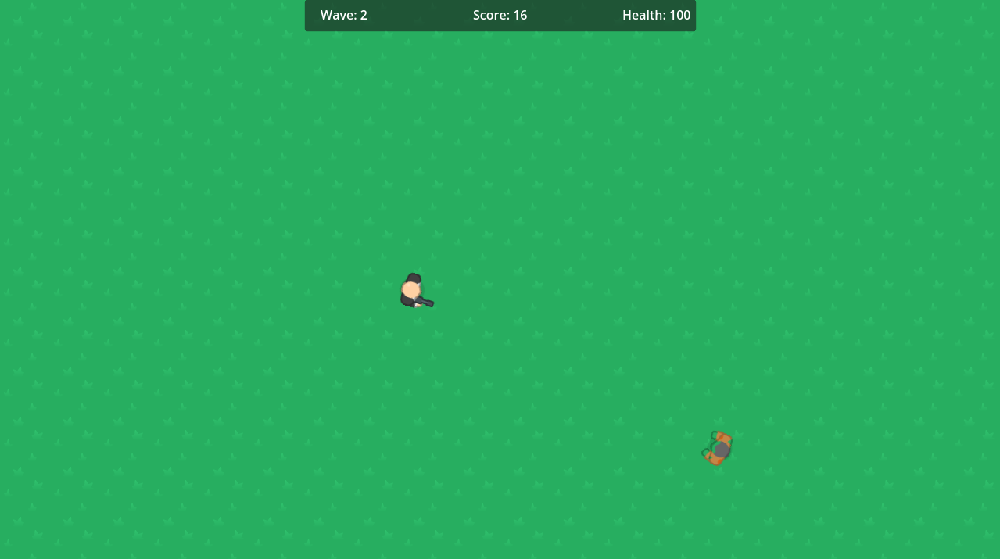

# Zombie Survival
A simple project for getting used to Godot 4

### About
-------------
This project was made for me to get a bit friendly with Godot 4. I also made it to help get my friend, Dipshtick (Varga) on board with Godot.  
The game itself is nothing special, it's an infinite wave shooter, but the game's code can be easily expanded upon to add more features.  
Current features are:
<ul>
  <li>Basic UI that keeps updating itself</li>
  <li>Infinite wave mechanic</li>
  <li>Player movement and shooting/li>
  <li>Two different weapons and Zombie "AI"</li>
</ul>
Being a project made to teach means there are way more comments that I'd normally put in, but maybe someone will need those so I left them in.  
Please note this game is not shared on any websites. If somehow you'd find it somewhere, it's probably a fake. You can build the game yourself from Godot or play in editor. 

### Getting Started
-------------
To compile this project, you will need regular Godot 4. Do not forget you will need the required export templates.   
More in-depth guide is avaiable here: https://docs.godotengine.org/en/stable/tutorials/export/exporting_projects.html  
You're free to modify the project as you wish.

### Credits
-------------
Thanks to DipShtick (Varga) for testing.  
Graphical assets were made by Kenney (https://kenney.nl/)  

### Preview
-------------

